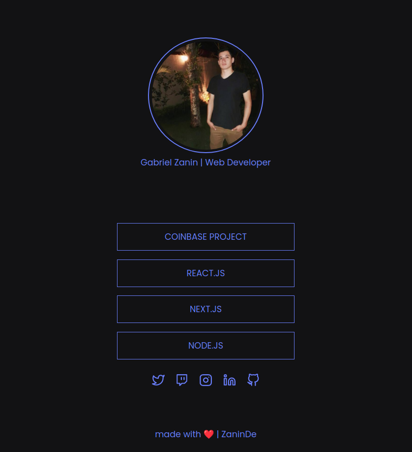

<h1 align="center"">
 Social Tree
</h1>

  <a href="#-tecnologias">Technologies</a>&nbsp;&nbsp;&nbsp;|&nbsp;&nbsp;&nbsp;
  <a href="#-projeto">Project</a>&nbsp;&nbsp;&nbsp;|&nbsp;&nbsp;&nbsp;
  <a href="#-layout">Layout</a>&nbsp;&nbsp;&nbsp;|&nbsp;&nbsp;&nbsp;
  <a href="#memo-licença">Licence</a>

 

  

 

  

## 🚀 Technologies

This project was developed with the following technologies:

- HTML
- CSS
- JavaScript

## 💻 Project

This application help you to know a little bit about the developer perfil

## :clound Deploy

You can see the deploied version [here](https://social-presentation.herokuapp.com/).

## :memo: Licence

This project have MIT licence. See the file [LICENSE](.github/LICENSE.md) to more details.

---

built with ♥ by ZaninDe

